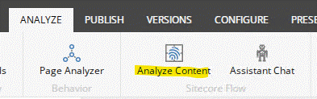
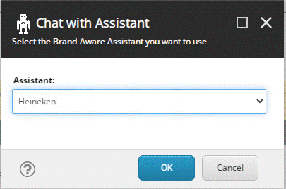
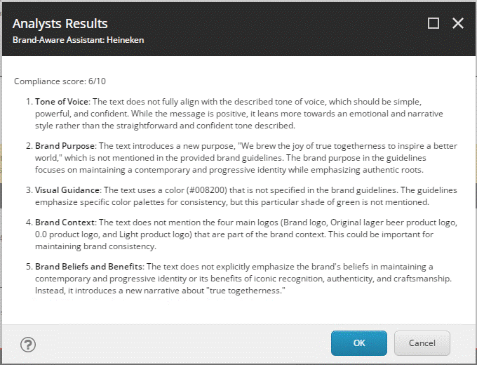
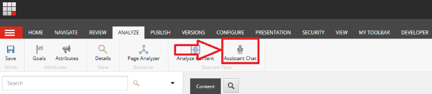
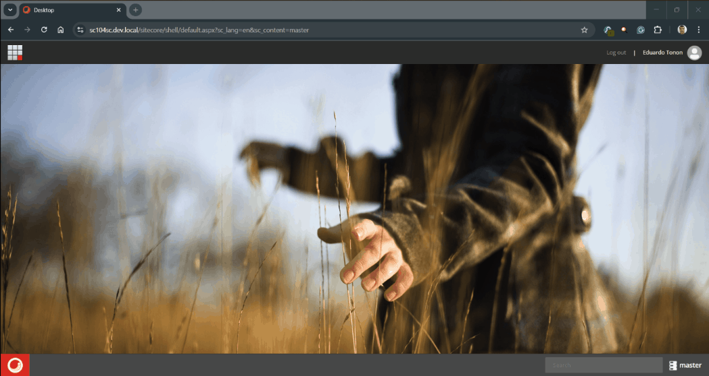

# Sitecore Flow

## Team name

⟹ **Go Horse**

- Eduardon Tonon
- José Neto
- Rodrigo Peplau

## Category

⟹ AI

## Description

**Module Purpose:**
This module integrates advanced AI into your Sitecore platform, helping your marketing and content teams easily maintain brand consistency. It ensures brand guidelines are respected, improving customer engagement, simplifying brand management, and delivering effective, data-driven results.

- **How it works:**
  It enables marketers to train Brand-Aware Assistants and use them to analyze if their content matches the Brand guidelines, giving a score and recommendations. It also offers a chat to freely inquiry the assistant.

## Video link

⟹ [Sitecore Flow](https://youtu.be/_t2V36GUc2I)

## Compatibility

- Sitecore XP 10.4
- Sitecore XM 10.4

## Pre-requisites and Dependencies

- [Sitecore Powershel Extensions 7.0](https://github.com/SitecorePowerShell/Console/releases/tag/7.0)
- [OpenAI API Key](CreatingAPIKeys.md)
- itextsharp.dll (included in the package)

## Installation instructions

1. Use the Sitecore Installation wizard to install the package [Sitecore Flow-1.0.zip](https://github.com/Sitecore-Hackathon/2025-Go-Horse/raw/refs/heads/main/dist/Sitecore%20Flow-1.0.zip) - In case of any conflicts, select Merge/Merge
2. (Optional) For your convenience, we have prepared a package with the Heineken Assistant pre-trained. After installing the package above, please also install the package [Sitecore Flow - Heineken Assistant-1.0.zip](https://github.com/Sitecore-Hackathon/2025-Go-Horse/raw/refs/heads/main/dist/Sitecore%20Flow%20-%20Heineken%20Assistant-1.0.zip). Again, in case of conflicts, select Merge/Merge

### Configuration

1. Configure the API Key on "/sitecore/system/Modules/Sitecore Flow/Settings"
2. Select the desired model.

### Training your Assistant

**⟹ This step can be skipped if you opted to install the package Sitecore Flow - Heineken Assistant-1.0.zip**

1. Go to /sitecore/system/Modules/Sitecore Flow/Assistants
2. Right click on the folder "Assistants" and create an item of type Assistant
3. Give a name for your Asssistant (Eg: "Heineken")
4. Under your assistant, right click again to create a new Document item
5. In the Document field, Upload and select your document **(Only PDFs are supported)**.
6. Click back in the Assistant item (Eg: "Heineken") and on the ribbon "Analyze", click -> 'Populate Assistant"
7. Check all the fields being populated

## Usage instructions

### Analyze Content

You can quickly analyze your content to verify if it matches the guidelines of your brand using our Brand-Aware Assistant.

1. Select any content item to be analyzed (it has to be under /sitecore/content)
2. Under the Ribbon "ANALYZE", click the button "Analyze Content"
   
3. Select the Assistant you want to use (Eg: Heineken).
   
5. Wait for the results, you will receive a diagnostic of your content
   

### Chat With Assistant

Chat With Assistant feature allows marketers to chat with the selected assistant.

1) This option is available on the ribbon on the "ANALYZE" tab as "Assistant Chat" button.

2) Click on the "Assistant Chat" button then select the Assistant on popup opened.

## Comments

This module significantly streamlines brand management by integrating AI directly into the content editing workflow. It provides immediate feedback by comparing content against brand guidelines, ensuring consistent branding across all channels. Future enhancements could include expanding AI recommendations for content optimization or integrating additional file formats for style guides.

